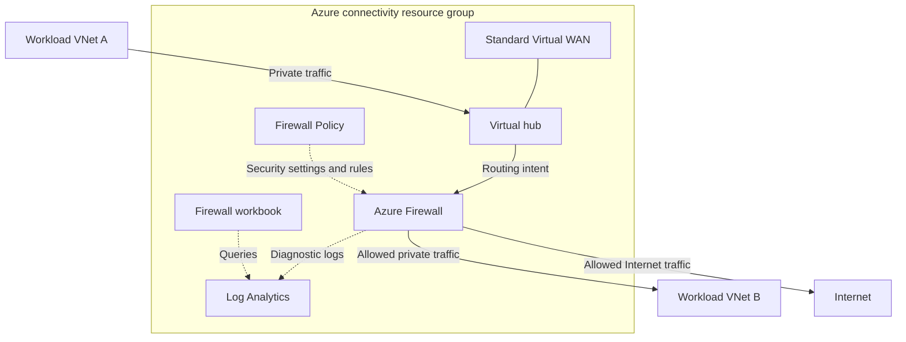

# Solution and configuration

## Current availability

The single-hub Bicep blueprint supports a Standard Virtual WAN, one hub,
optional Azure Firewall, a new firewall policy, and optional firewall
logging and workbook deployment.

The files have passed local compilation. Live deployment, routing, and
monitoring validation remain pending. The portal form and multi-hub
blueprint are not available yet.

## Single-hub architecture

The following diagram shows the intended inspected traffic paths when
inspectionMode is Both. Workload VNets are shown for context; this blueprint
does not currently create or connect them.

The arrows illustrate logical traffic paths rather than physical links.
Return traffic is subject to routing and stateful firewall processing.

## Components and ownership

All resources currently created by the blueprint reside in the selected
deployment resource group. Hub, policy, and monitoring locations can differ.

| Component | Role | Current behavior |
| --- | --- | --- |
| Standard Virtual WAN | Global connectivity container | Created |
| Virtual hub | Regional routing | Created |
| Azure Firewall | Traffic inspection | Created unless inspection is Disabled |
| Firewall Policy | Security settings and rules | Created with the firewall |
| Routing intent | Redirect selected traffic to the firewall | Depends on inspection mode |
| Log Analytics workspace | Store firewall logs | Created when firewall logging is enabled |
| Firewall diagnostics | Send resource-specific logs and metrics | Enabled with logging |
| Azure Monitor workbook | Explore firewall events | Created when logging and workbook deployment are enabled |
| Workload VNets and connections | Attach application networks | Not implemented yet |
| VPN and ExpressRoute gateways | Hybrid connectivity | Not implemented yet |

Referencing the firewall as an existing resource inside the Bicep code is
used to attach diagnostics to the firewall created by the network module.
It is not an option to adopt an unrelated existing firewall.

## Inspection modes

| inspectionMode | Firewall | Private routing intent | Internet routing intent |
| --- | --- | --- | --- |
| Disabled | No | No | No |
| FirewallOnly | Yes | No | No |
| Private | Yes | Yes | No |
| Internet | Yes | No | Yes |
| Both | Yes | Yes | Yes |

Default: Both.

FirewallOnly does not redirect traffic through the firewall using routing
intent. Disabled provides no Azure Firewall inspection.

Routing intent determines inspection paths; firewall rules determine which
traffic is permitted. Creating a firewall is not evidence that traffic
actually traverses it.

## Names, regions, and addresses

| Input | Meaning |
| --- | --- |
| virtualWanName | Name of the Standard Virtual WAN |
| virtualWanLocation | WAN resource location; defaults to the resource group location |
| hubName | Name of the virtual hub |
| hubLocation | Hub region; defaults to the resource group location |
| hubAddressPrefix | Hub IPv4 CIDR; /24 or larger, with no overlap |
| tags | Owner, environment, cost centre, and other resource tags |

Hub address ranges must not overlap other hubs, connected workload VNets,
or connected on-premises networks. Confirm address allocation before deploying.

Names identify resources. Redeploying with the same names and scope can update
existing resources. Ownership and collision safeguards are not implemented yet.

## Firewall and policy

| Input | Default | Meaning |
| --- | --- | --- |
| firewallName | Hub name plus -fw | Firewall resource name |
| firewallTier | Standard | Standard or Premium; also sets the policy tier |
| firewallPublicIpCount | 1 | Number of firewall public IP addresses |
| firewallZones | Empty | Optional supported availability zones in the hub region |
| firewallPolicyName | Hub name plus -policy | New policy resource name |
| firewallPolicyLocation | Hub location | Explicit policy location |
| threatIntelMode | Deny | Threat intelligence action: Alert, Deny, or Off |
| enableDnsProxy | false | Enable firewall DNS proxy |
| firewallRuleCollectionGroups | Empty | Approved firewall rules |

The policy and firewall use the same tier. Premium selection alone does not
configure TLS inspection or IDPS settings.

The default rule list is empty and supplies no explicit Allow rules. Add
approved rules before connecting workloads; this is not a permissive example.

Enabling DNS proxy does not automatically change workload DNS settings.
DNS configuration must be designed together with application-rule requirements.

Availability-zone support depends on the chosen region. An empty zone list
does not request explicit zone placement.

## Monitoring

| Input | Default | Meaning |
| --- | --- | --- |
| enableLogging | true | Enable workspace creation and firewall diagnostics |
| workspaceName | Hub name plus -logs | New workspace name |
| workspaceLocation | Hub location | Workspace and workbook location |
| logRetentionDays | 30 | Workspace retention, from 30 to 730 days |
| enableWorkbook | true | Create the workbook when logging is enabled |

When inspection is Disabled, neither the workspace nor the workbook is created.
When logging is disabled, the workbook is not created.

Diagnostics send all firewall log categories and AllMetrics to the workspace.
Logs use resource-specific tables. Logging volume and retention affect costs.

The current workspace uses public ingestion and query endpoints with Azure
authorization. Private monitoring connectivity is not configured by this
blueprint.

The workbook initially selects the deployed workspace and firewall, with a
one-hour time range. Its controls allow viewers to select other accessible
firewalls or all firewalls. These filters do not grant access to resources.

Logs require traffic and ingestion time. An empty workbook immediately after
deployment does not by itself prove a deployment failure.

## Deployment outputs

| Output | Purpose |
| --- | --- |
| virtualWanResourceId | Identify the deployed WAN |
| virtualHubs | Hub identities and deployment information |
| firewallResourceId | Firewall identity, or an empty string when disabled |
| firewallPolicyResourceId | Policy identity, or an empty string when disabled |
| workspaceResourceId | Workspace identity, or an empty string when logging is disabled |
| selectedInspectionMode | Selected inspection mode |
| workbookResourceId | Workbook identity, or an empty string when not deployed |
| observabilityUrl | Azure portal workbook URL, or an empty string when not deployed |

Workbook viewing requires appropriate Azure permissions.

## Configuration file

For code-based configuration, review:

- blueprints/single-hub/main.example.bicepparam

It demonstrates names, regions, inspection settings, policy settings, and
logging settings. Review every example value before deployment.

Portal-based configuration will be documented when the input form is available.

## Updates and removal

Keep resource names stable when intentionally updating an environment.
Changing a name can create another resource and leave the previous resource
in place during an incremental deployment.

Turning an option off is not a supported cleanup procedure for resources
already deployed. Incremental deployments can retain resources omitted from
the new template.

Update safeguards, expansion instructions, and explicit removal procedures
must be validated before production use.

## Costs and scope

Resources incur charges while deployed. The blueprint does not enforce a
spending cap, schedule expiry, or automatically remove resources.

This is a network deployment foundation. It does not implement application
disaster recovery, a complete Zero Trust program, or a full enterprise
landing zone.

The Microsoft workbook source, local modifications, and license are recorded
in [the workbook source record](../modules/observability/SOURCE.md).
